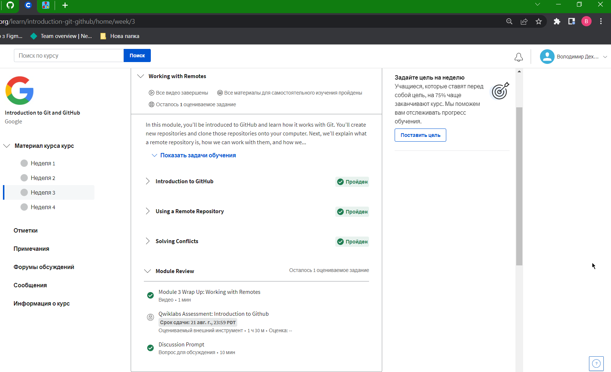
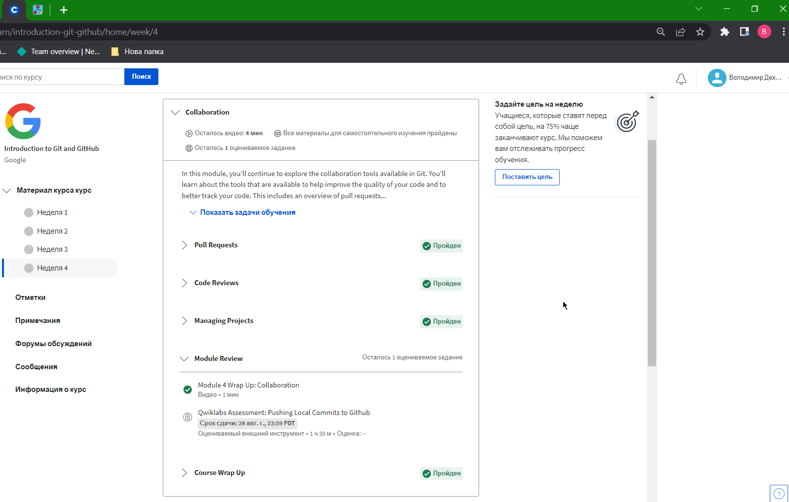
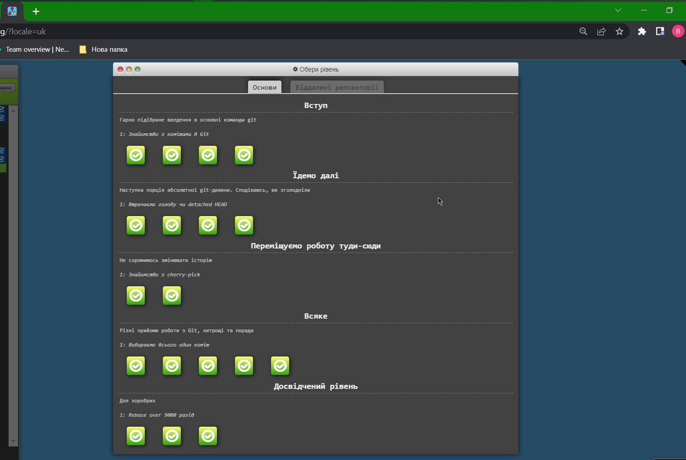
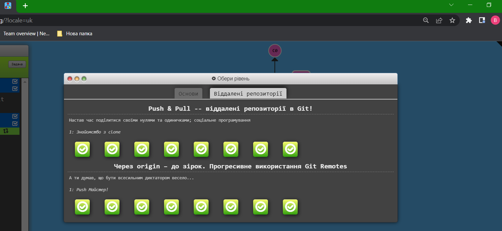
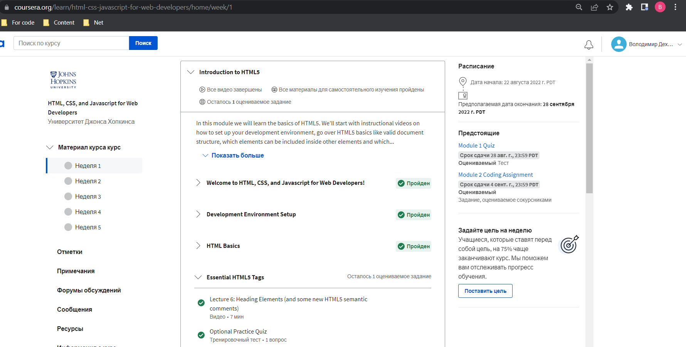
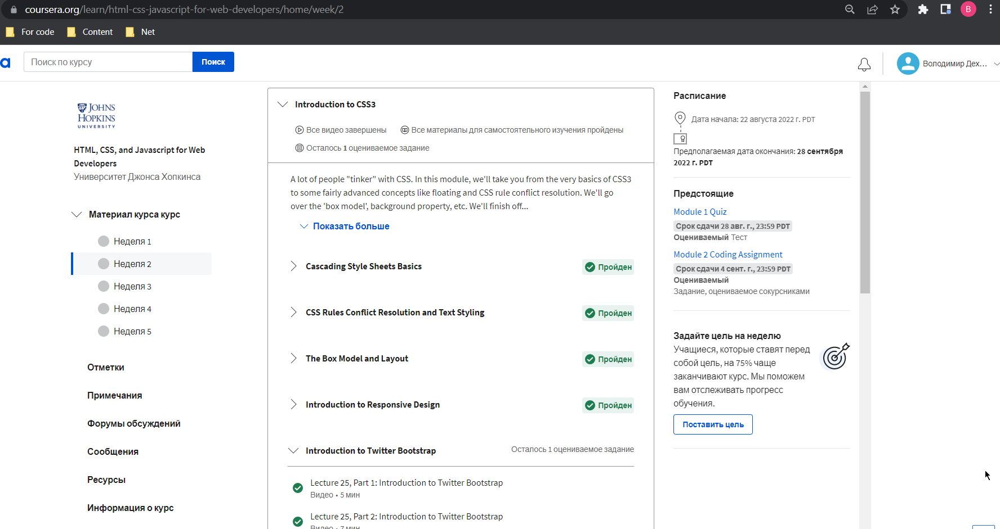
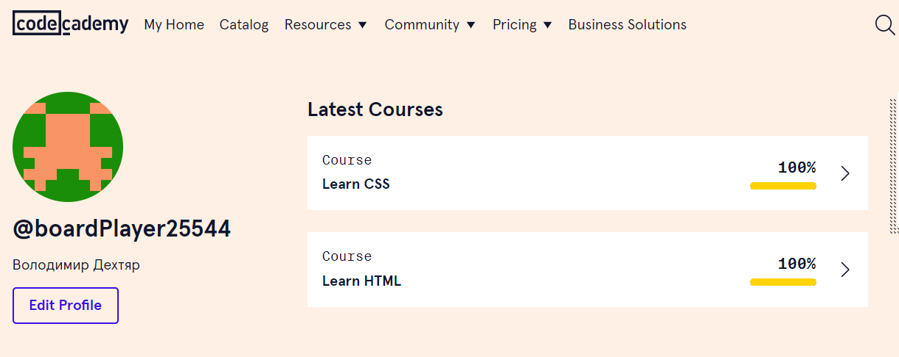

## Feedback about GIT learning module.
Матеріал зрозумілий, цікавий, викладений стисло.

Деякі складнощі викликає робота з гілками/ віддаленими репозиторіями, але повернення/переглядання/перечитування матеріалу допомагає розібратись.

## Linux CLI, and HTTP

(1) Linux Survival course: 

Нове: Робота з man. (дійсно зручно)

Здивувало: факт, що далеко не всі запущені програми закриваються через kill (!) і навіть kill -9 (!!!)

Планую використовувати у майбутньому: більшість команд, таких як cd, rm, mv etc..

(2) HTTP: Протокол, який повинен розуміти кожний веб-розробник - Частина 1:

Нове: інформація про принципи роботи HTTP.

Здивувало: кількість заморочок для/можливостей забезпечити безпечне з'єднання (приємно здивувало).

Планую використовувати у майбутньому: запропоновані статті коли прийде час більш детально розбиратись/працювати з HTTP.

(3) HTTP: Протокол, який повинен розуміти кожний веб-розробник - Частина 2:

Нове: більшість інформації.

Здивувало: різні можливості для обмеження актуальності контенту.

Планую використовувати у майбутньому: запропоновані статті коли прийде час більш детально розбиратись/працювати з HTTP.

## Git Collaboration
### Coursera

Нове: більша частина інформації. Все, що торкалось безпосередньої роботи з github.

Здивувало: можливості github. Варіативність підходів, тонке налаштування під конкретні потреби. 

Планую використовувати у майбутньому: сподіваюсь все. Точно- роботу з приватними репозиторіями.

Week 1

Week 2

Week 3

Week 4

### Learngitbranching

Нове: візуалізація роботи з комітами. Стало набагато зрозуміліше.

Здивувало: кількість варіантів вирішення однієї і тієї ж задачі. 

Планую використовувати у майбутньому: цей сайт для закріплення і повторення інформації.

Basics

Remote repos

## Intro to HTML and CSS

### Coursera

Нове: Підходи до роботи з респонсів дизайном.

Здивувало: Краса і простота розбивки в Twitter Bootstrap.

Планую використовувати у майбутньому: Всі знання в цілому, зокрема Twitter Bootstrap.

Week 1

Week 2

### Codecademy

Нове: Варіанти роботи з палітрами.

Здивувало: Те, що можна задавати купу "запасних шрифтів".

Планую використовувати у майбутньому: Сторонні шрифти.

HTML + CSS

